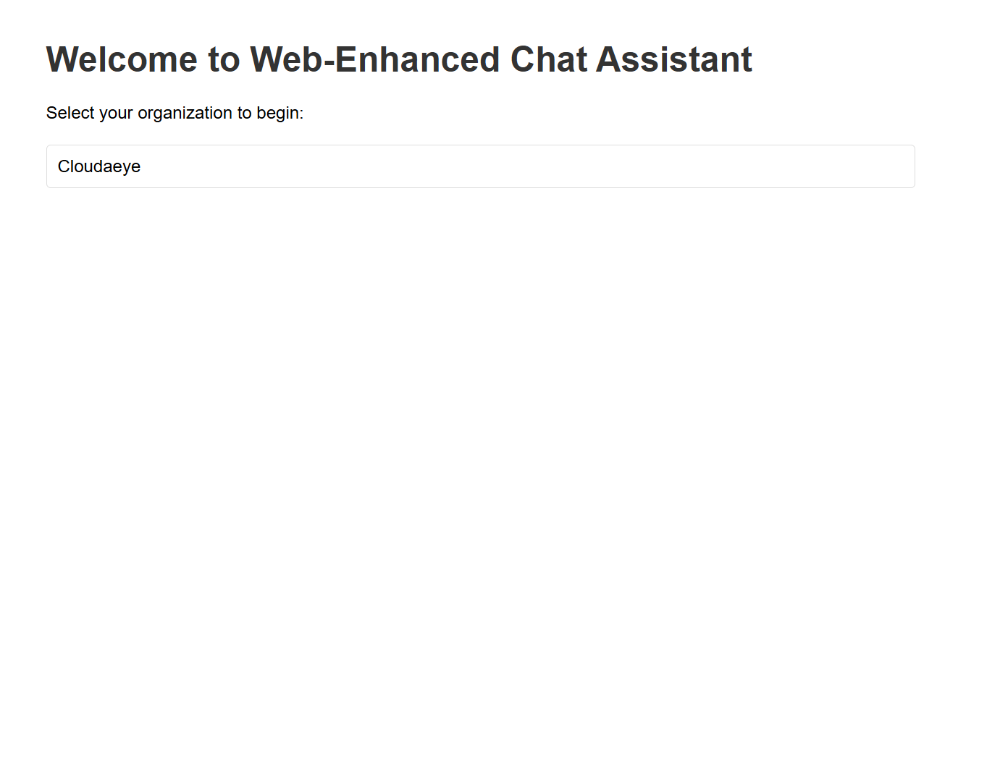
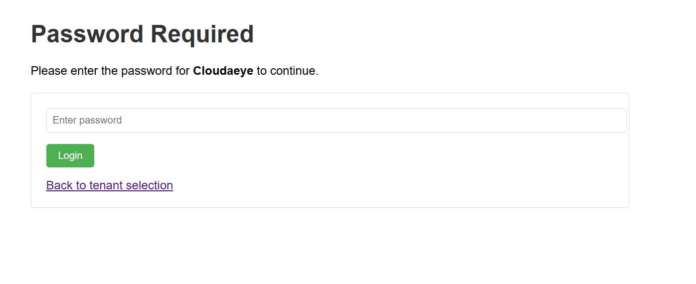
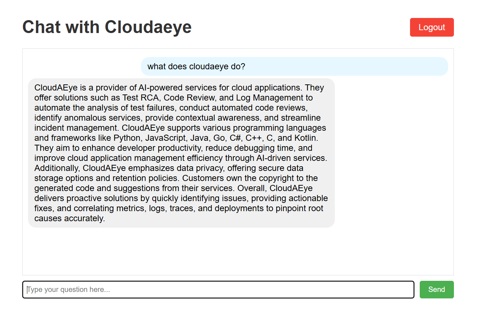

# Web-Enhanced Chat Assistant

## Overview

Web-Enhanced Chat Assistant is a CrewAI-powered application that helps support agents answer customer questions by retrieving information from publicly available web documents. The system combines browser-based web searches with conversation context to provide accurate and helpful responses.

## Key Features

- **Web Content Retrieval**: Accesses and processes information from specified web pages
- **Intelligent Agent Collaboration**: Uses CrewAI to coordinate specialized agents:
  - Web Researcher: Searches and extracts information from web pages
  - Chat Agent: Crafts helpful responses using retrieved information
- **Conversation Memory**: Maintains chat history for context-aware responses
- **Multi-tenant Support**: Organizations can use the same system with their own customized configuration
- **Simple Web Interface**: Flask-based interface for tenant selection and chat


## How It Works

1. **Tenant Configuration**: Organizations provide their company name and relevant URLs in a `tenant_info.json` file
2. **Web Content Processing**: The system crawls web pages for each tenant when needed
3. **Chat Interface**: Users select their organization and interact with the chatbot
4. **Query Processing**: When a user asks a question:
   - The Web Researcher crawls relevant web pages for information
   - The Chat Agent combines this information with conversation history to create helpful responses

## Technical Components

- **CrewAI**: Framework for orchestrating multiple specialized agents
- **LangChain**: Tools for web page loading and retrieval
- **Web Crawling**: Direct access to web content through LangChain's WebBaseLoader
- **LLM Integration**: ChatOpenAI for natural language understanding and generation
- **Web Framework**: Flask for the user interface

## Getting Started

1. Install dependencies: `pip install -r requirements.txt`
2. Create a `.env` file with your API keys
3. Configure tenant information in `tenant_info.json`
4. Run the application: `python app.py`
5. Access the web interface at `http://localhost:5000`

### Simple UI Interface:
### Home 


### Authentication while selecting organisation


### Chat with the organisation 


## Configuration

Tenant information is stored in `tenant_info.json` with the following structure:

```json
{
  "tenant_id": {
    "name": "Tenant Organization Name",
    "doc_urls": [
      "https://tenant-domain.com/docs/page1",
      "https://tenant-domain.com/docs/page2"
    ]
  }
}